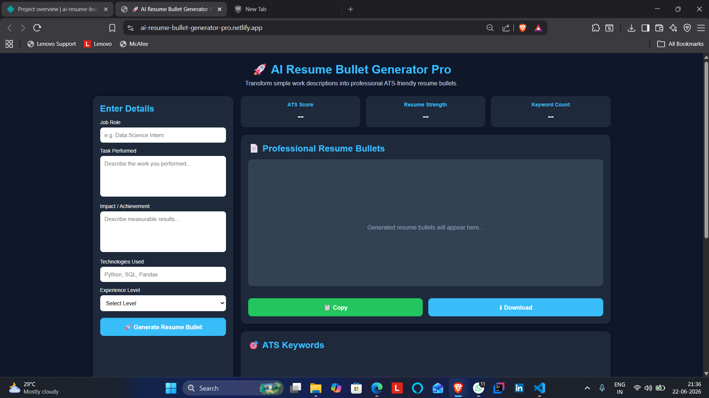
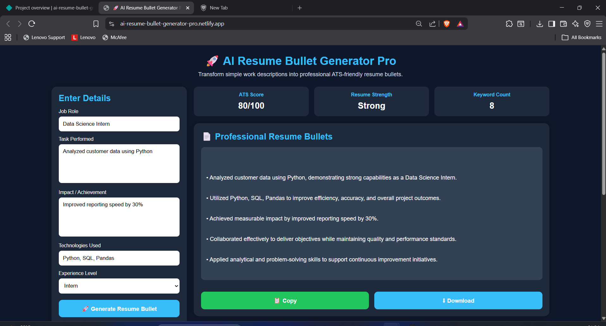
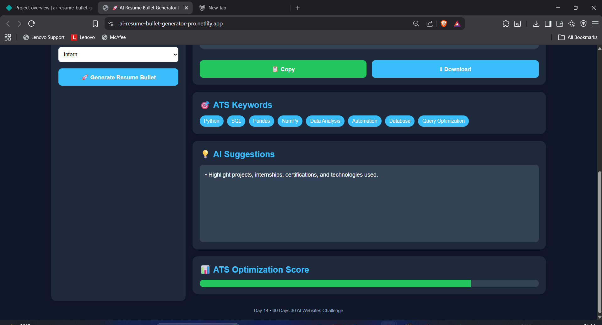

# AI Resume Bullet Generator Pro

## 🚀 Day 14 of my 30 Days 30 AI Websites Challenge

AI Resume Bullet Generator Pro helps students, freshers, developers, and professionals convert simple work descriptions into professional ATS-friendly resume bullets for resumes, portfolios, and job applications.

## 🌐 Live Demo

https://ai-resume-bullet-generator-pro.netlify.app/

## 📸 Screenshots

## ✨ Features

* Professional Resume Bullet Generation
* ATS Score Analysis
* Resume Strength Evaluation
* ATS Keyword Extraction
* AI Improvement Suggestions
* Technology-Based Recommendations
* Progress Score Visualization
* Copy Generated Bullets
* Download Resume Bullets
* Responsive Design

## 📋 User Inputs

* Job Role
* Task Performed
* Impact / Achievement
* Technologies Used
* Experience Level

## 🎯 Generated Outputs

* ATS-Friendly Resume Bullets
* ATS Score
* Resume Strength
* Technical Keywords
* AI Suggestions
* Optimization Score

## 📌 Example

### Input

Role: Data Science Intern

Task: Analyzed student performance data using Python and Pandas

Impact: Reduced report generation time by 30%

Technologies: Python, SQL, Pandas

Experience: Intern

### Output

* Professional ATS-Friendly Resume Bullets
* ATS Score: 90+
* Resume Strength: Excellent
* Technical Keywords
* AI Suggestions

## 🛠 Technologies Used

* HTML
* CSS
* JavaScript
* AI-Assisted Development

## 📋 How It Works

1. Enter job role.
2. Describe the task performed.
3. Enter measurable impact or achievement.
4. Add technologies used.
5. Select experience level.
6. Generate ATS-friendly resume bullets.
7. Copy or download the generated output.

## 🚀 Challenge

This project is part of my 30 Days 30 AI Websites Challenge where I build and publish one AI-assisted website every day.

## 📈 Progress

* Day 1 ✅ AI Resume Analyzer
* Day 2 ✅ AI Career Roadmap Generator
* Day 3 ✅ AI Project Idea Generator
* Day 4 ✅ AI Skill Gap Analyzer
* Day 5 ✅ AI Interview Question Generator
* Day 6 ✅ AI Portfolio Review Analyzer
* Day 7 ✅ AI LinkedIn Post Generator
* Day 8 ✅ AI Salary Predictor
* Day 9 ✅ AI Startup Idea Validator
* Day 10 ✅ AI Study Planner
* Day 11 ✅ AI Tech Stack Recommender Pro
* Day 12 ✅ AI Productivity Dashboard
* Day 13 ✅ AI Career Decision Assistant
* Day 14 ✅ AI Resume Bullet Generator Pro

## 👨‍💻 Author

Bettam Anand

B.Tech CSE (Data Science)

JNTUH University College of Engineering Palair
